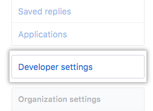

# Создание токена для работы с GitHub

1. Подтвердите свой адрес электронной почты, если он еще не подтвержден.

2. В правом верхнем углу любой страницы щелкните фотографию своего профиля, затем нажмите **Settings** (Настройки). 


3. На левой боковой панели нажмите **Developer settings** (Настройки разработчика). 
   



4. На левой боковой панели щелкните **Personal access tokens** (Личные токены доступа).


5. Щелкните **Generate new token** (Создать новый токен).


6. Дайте вашему токену описательное имя (любое, удобное Вам).


7. Выберите области или разрешения, которые вы хотите предоставить этому токену. Чтобы использовать свой токен для доступа к репозиториям из командной строки, выберите **repo**.


8. Щелкните **Generate token** (Создать токен).


9. Щелкните кнопку , чтобы скопировать токен в буфер обмена. По соображениям безопасности после того, как вы покинете страницу, вы больше не сможете увидеть токен. Сохраните его в удобном и надёжном месте, чтобы не потерять.


10. В дальнейшем, при запросе учетных данных (логина и пароля), вместо пароля указывайте этот токен.

```
$ git clone https://github.com/username/repo.git
Username: ваш юзернейм
Password: токен, который вы сгенерировали
```

> Предупреждение: относитесь к своим токенам как к паролям и держите их в секрете. Обязательно сохраните токен и не теряйте его! При утере проделайте все шаги заново.

[Оригинал](https://docs.github.com/en/github/authenticating-to-github/keeping-your-account-and-data-secure/creating-a-personal-access-token)
